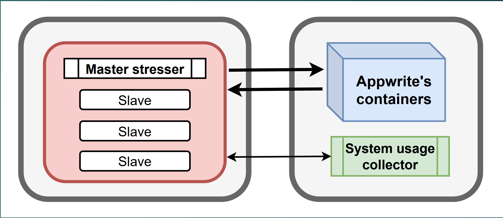
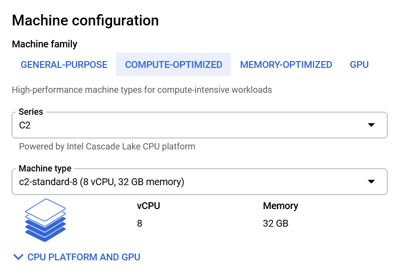
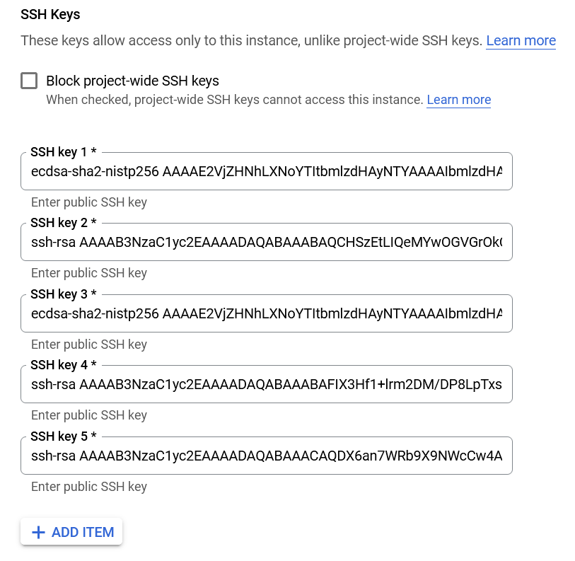

# Cloud benchmark WS2022/2023
This repository holds source code and instruction as well as sample data for the module.

The goal of the project is to benchmark the (mass) request handling capability of a single Appwrite instance, here runs on Google Computing cloud. The results can be used to:
1. Understand the capability of Appwrite's software stack on a single machine in 2 metrics: request/sec handled and latency of requests
2. Test the vertical scalability of Appwrite on Google Cloud Computing VM
3. Base on these, estimate and balance the specs needed: can a 2 vCores VM be used for my particular usecase and expected load?

There are 2 main metrics used to evaluate the results:
- A. Request/sec: The number of request per second that the server can handle. This is calculated as `total_request`/`total_time_test_run`. Note: there are thresholds after which the server can not process the incomming request right-away and have to be put in waiting queue, which results in higher latency for such requests. 
- B. Latency: We calculate the request latency by `t3-t0`, in which `t0=timestamp_client_send_request` and `t3=timestamp_client_receive_result`. The portion of latency causes by geography is ignored (and should be negliable anyway because our VMs located in the same datacenter), since we only interested in the time interval that server needed to process a single request. This value is *greatly* affected by __number of concurrent requests are being processed__ on server, __number of request in Appwrite's queue__ and __server's resources__.

The architecture of the benchmark setup:

<figure style="text-align: center;">
  
  <figcaption style="text-align: center;">2 VMs for Client Test (left) and System under Test (right)</figcaption>
</figure>

Each test consisted of 2 general purpose VMs running Debian 11. Thanks to the ability to edit VM's specification on Google Cloud, the same 2 VMs disk can be run on different hardware resources: CPU vCores, RAM, ... to test diffrent scenarios: low-end server, high-end server. We use the same 8 vCore AMD VM for the client machine for consistent results.

<figure style="text-align: center;">
  
  <figcaption style="text-align: center;">Set hardware spec on Google Cloud (only when VM is off)</figcaption>
</figure>

## Gotcha
- NodeJS/Javascript's Promise is hard to get right for newcomers. The benchmark scripts are written in JS and are far from perfect. Many used `await` are unneccessary, however obligated to make the current programs run correctly.
- Google Cloud are not always scalable. Sometimes starting a high-spec VM (especially with AMD processor) fails due to excess VM instances quota. Waiting usually required in such case.
- Google cloud SSH key expiration can be annoying sometimes. Set a (relatively) permanent one: `ssh-rsa your_public_key_here google-ssh {"userName":"your_email","expireOn":"2024-02-06T18:53:55+0000"}`
<figure style="text-align: center;">
  
  <figcaption style="text-align: center;">Edit => add SSH key</figcaption>
</figure>


## Instruction to install and run on cloud: debian 11, node 16, python3

```bash
# debian 11, node 16
sudo apt update
sudo apt install git htop python3-pip python3-venv -y
# python3 -m pip install --user virtualenv

#### Client
curl -fsSL https://deb.nodesource.com/setup_16.x | sudo bash - &&\
sudo apt-get install -y nodejs
git clone https://github.com/Que0Le/cloudbenchmark_ws22.git
python3 -m venv env
source env/bin/activate
python3 -m pip install pip install -r requirements.txt
cd cloudbenchmark_ws22
npm i
mkdir log_data

nano .env   # copy form from env_sample.env and add real data

## POST
POSTGET=post MAX_REQ_PER_TASK=2 MAX_REQ=2000 NBR_WORKERS=10 RUN_MODE=silent DB_DATA_HALF_LENGTH=100
SESSION_ID_POST="${POSTGET}.workers=${NBR_WORKERS}.task_size=${MAX_REQ_PER_TASK}.total=${MAX_REQ}.column_length=${DB_DATA_HALF_LENGTH}"
# rm log_client_*[0-9]_*post*.txt
NODE_NO_WARNINGS=1 node mass_post.js $SESSION_ID_POST $MAX_REQ_PER_TASK $MAX_REQ $NBR_WORKERS $RUN_MODE $DB_DATA_HALF_LENGTH
python3 read_data.py $SESSION_ID_POST

## GET
COLLECTION_ID=63d929846ad2459e4ed7
POSTGET=get MAX_REQ_PER_TASK=2 MAX_REQ=2000 NBR_WORKERS=10 RUN_MODE=silent DB_DATA_HALF_LENGTH=100
SESSION_ID_GET="${POSTGET}.workers=${NBR_WORKERS}.task_size=${MAX_REQ_PER_TASK}.total=${MAX_REQ}.column_length=${DB_DATA_HALF_LENGTH}"
rm log_client_*[0-9]_*get*.txt
NODE_NO_WARNINGS=1 node mass_get.js $SESSION_ID_GET $MAX_REQ_PER_TASK $MAX_REQ $NBR_WORKERS $RUN_MODE $COLLECTION_ID $SESSION_ID_POST
python3 read_data.py $SESSION_ID_GET


### Server
# Appwrite
mkdir appwrite
sudo docker run -it --rm --volume /var/run/docker.sock:/var/run/docker.sock --volume "$(pwd)"/appwrite:/usr/src/code/appwrite:rw --entrypoint="install" -e _APP_OPTIONS_ABUSE=disabled appwrite/appwrite:1.1.1
git clone https://github.com/Que0Le/cloudbenchmark_ws22.git
cd cloudbenchmark_ws22
python3 -m venv env
source env/bin/activate
python3 -m pip install pip install -r requirements.txt
uvicorn system_stat:app --host 0.0.0.0 --port 8888

```


## Instruction to install on development machine: Ubuntu 20, Node 16

```bash
sudo apt update
sudo apt install git htop
sudo apt install -y apt-transport-https ca-certificates curl software-properties-common
curl -fsSL https://download.docker.com/linux/ubuntu/gpg | sudo apt-key add -
sudo add-apt-repository "deb [arch=amd64] https://download.docker.com/linux/ubuntu focal stable"
sudo apt install -y docker-ce

sudo usermod -aG docker ${USER}
su - ${USER}

# Appwrite
mkdir appwrite
sudo docker run -it --rm --volume /var/run/docker.sock:/var/run/docker.sock --volume "$(pwd)"/appwrite:/usr/src/code/appwrite:rw --entrypoint="install" -e _APP_OPTIONS_ABUSE=disabled appwrite/appwrite:1.1.1


git clone https://github.com/Que0Le/cloudbenchmark_ws22.git
cd cloudbenchmark_ws22


## stop
docker container stop $(docker container ls -q --filter name=appwrite*)

# Choose your server HTTP port: (default: 80)
# 80
# Choose your server HTTPS port: (default: 443)
# 443
# Choose a secret API key, make sure to make a backup of your key in a secure location (default: 'your-secret-key')

# Enter your Appwrite hostname (default: 'localhost')

# Enter a DNS A record hostname to serve as a CNAME for your custom domains.
# You can use the same value as used for the Appwrite hostname. (default: 'localhost')

# Running "docker compose -f /usr/src/code/appwrite/docker-compose.yml up -d --remove-orphans --renew-anon-volumes"

# http://localhost:3000/

```


```bash
sudo apt install python3.8-venv
python3 -m venv env
source env/bin/activate

# python3 -m pip install pip install -r requirements.txt
# pip3 freeze > requirements.txt
python3 -m pip install uvicorn fastapi psutil matplotlib numpy
# Ctrl+Shift+P to select Python interpreter

uvicorn system_stat:app --host 0.0.0.0 --port 8888

# extract deps
# pip freeze > requirements.txt
```

```bash
curl -fsSL https://deb.nodesource.com/setup_16.x | sudo -E bash - &&\
sudo apt-get install -y nodejs

sudo apt install npm
npm i


mkdir log_data
## POST
POSTGET=post MAX_REQ_PER_TASK=2 MAX_REQ=2000 NBR_WORKERS=10 RUN_MODE=silent DB_DATA_LENGTH=100
SESSION_ID_POST="${POSTGET}.workers=${NBR_WORKERS}.task_size=${MAX_REQ_PER_TASK}.total=${MAX_REQ}.column_length=${DB_DATA_HALF_LENGTH}"
# rm log_data/log_client_*[0-9]_*post*.txt
NODE_NO_WARNINGS=1 node mass_post.js $SESSION_ID_POST $MAX_REQ_PER_TASK $MAX_REQ $NBR_WORKERS $RUN_MODE $DB_DATA_HALF_LENGTH
python3 read_data.py $SESSION_ID_POST log_data

## GET
COLLECTION_ID=63d929846ad2459e4ed7
POSTGET=get MAX_REQ_PER_TASK=2 MAX_REQ=2000 NBR_WORKERS=10 RUN_MODE=silent DB_DATA_LENGTH=100
SESSION_ID_GET="${POSTGET}.workers=${NBR_WORKERS}.task_size=${MAX_REQ_PER_TASK}.total=${MAX_REQ}.column_length=${DB_DATA_HALF_LENGTH}"
# rm log_data/log_client_*[0-9]_*get*.txt
NODE_NO_WARNINGS=1 node mass_get.js $SESSION_ID_GET $MAX_REQ_PER_TASK $MAX_REQ $NBR_WORKERS $RUN_MODE $COLLECTION_ID $SESSION_ID_POST
python3 read_data.py $SESSION_ID_GET log_data

node -i -e "$(< ./mass_get.js)"

```