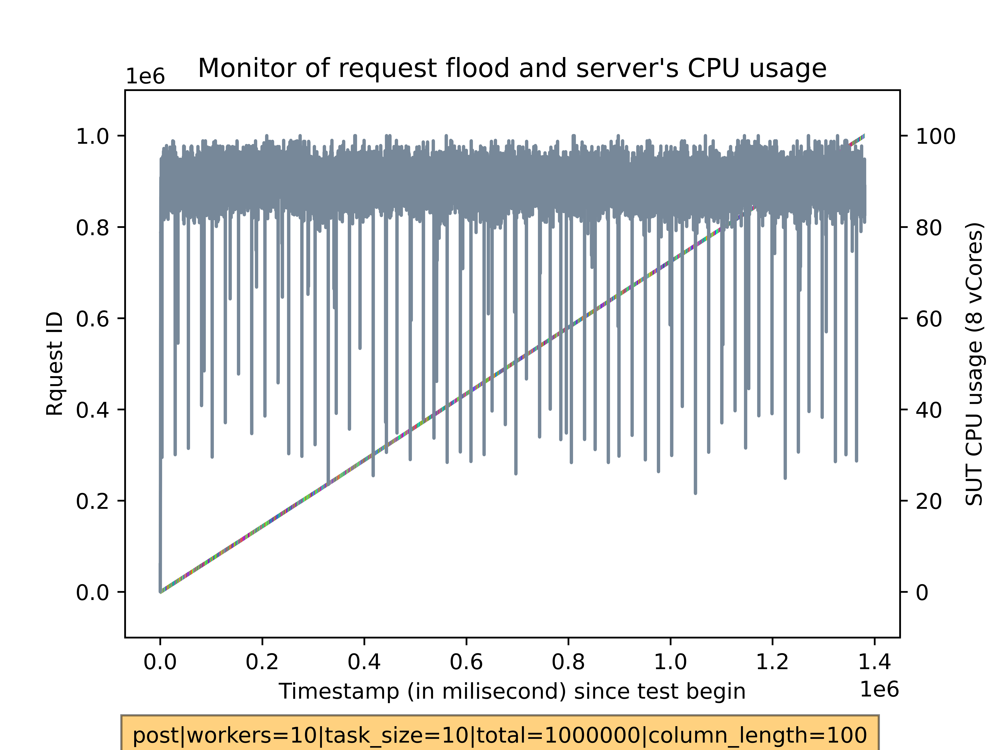
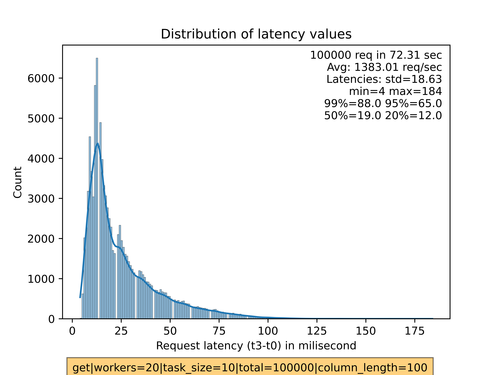

# Cloud benchmark WS2022/2023

## Introduction
This repository holds source code and instruction as well as sample data for the module.

The goal of the project is to benchmark the (mass) request handling capability of a single Appwrite instance, here runs on Google Computing cloud. The results can be used to:
1. Understand the capability of Appwrite's software stack on a single machine in 2 metrics: request/sec handled and latency of requests
2. Test the vertical scalability of Appwrite on Google Cloud Computing VM
3. Base on these, estimate and balance the specs needed: can a 2 vCores VM be used for my particular usecase and expected load?

There are 2 main metrics used to evaluate the results:
- A. Request/sec: The number of request per second that the server can handle. This is calculated as `total_request`/`total_time_test_run`. Note: there are thresholds after which the server can not process the incomming request right-away and have to be put in waiting queue, which results in higher latency for such requests. 
- B. Latency: We calculate the request latency by `t3-t0`, in which `t0=timestamp_client_send_request` and `t3=timestamp_client_receive_result`. The portion of latency causes by geography is ignored (and should be negligible anyway because our VMs located in the same datacenter), since we only interested in the time interval that server needed to process a single request. This value is *greatly* affected by __number of concurrent requests are being processed__ on server, __number of request in Appwrite's queue__ and __server's resources__.

The architecture of the benchmark setup:

<figure style="text-align: center;">
  
  <figcaption style="text-align: center;">2 VMs for Client Test (left) and System under Test (right)</figcaption>
</figure>

Each test consisted of 2 general purpose VMs running Debian 11. Thanks to the ability to edit VM's specification on Google Cloud, the same 2 VMs disk can be run on different hardware resources: CPU vCores, RAM, ... to test diffrent scenarios: low-end server, high-end server. We use the same 8 vCore AMD VM for the client machine for consistent results.

<figure style="text-align: center;">
  
  <figcaption style="text-align: center;">Set hardware spec on Google Cloud (only when VM is off)</figcaption>
</figure>

---
## Test design: 
Client: we use a VM box with exceeded resources (8 vCores) to run client program to make sure server will always be overwelmed with requests no matter how powerful it is.

Test Type: 2 types of test against Appwrite's APIs:
- POST request: test how many `create doc` requests can the server handle per second
- GET request: test retrieving data from server

Request's options:
- Client can set sending rate (by setting each worker's send rate with `MAX_REQ_PER_TASK` param)
- Client can set payload size (with `DB_DATA_LENGTH` param)
Server

Server's hardware spec:
- We configurate server to have different numbers of vCore


---
## Implementation
Our software stack:
- Test scripts written in `Javascript`, run on `NodeJS 16` runtime.
- Collecting server' statistic (RAM, CPU usage) with `Python3`. `Python3 FastAPI API framework` to create endpoints for signaling the collecting procedure as well as retrieving data.
- Data analysis using `Python3 + matplotlib, seaborn, pandas`.

### Test scripts
The request generator use master-slave model to overcome the fact that NodeJS is single-thread. This way, master manages slaves and assigns new task to slaves on request (pull-mode, where client actively request new task when ready):

```js
// signal the server to start the collecting stat
await req_start_collecting_stat(SESSION_ID)
// Pseudocode for master-slave model
var cluster = require('cluster');
cluster.schedulingPolicy = cluster.SCHED_NONE;

if (cluster.isMaster) {
        for (let i = 0; i < NBR_WORKERS; i++) {
            let worker = cluster.fork();
            worker.on('message', function (msg) {
            if ("request_new_task" in msg) {
                assign_new_task()
            }
        })
    } else {
        process.on("message", (msg) => {
            if ("ok_new_task_here" in msg) {
                await process_task()
                await request_new_task()
            }
        })
    }
}
```

The POST script (`mass_post.js`) stores results in text files for later usage. A sample of 1 request:
```
{
    "req_id"        :117,                       // request_th
    "doc_id"        :"63e15cce38712504bae9",    // server returns the ID of created document
    "t0"            :1675713742222,             // timestamp when client sent the request
    "t3"            :1675713742235,             // timestamp when client received the result from server
    "collection_id" :"63e15ccb71a4e434b74d"     // collection where this document is stored
}
```

The GET script (`mass_get.js`) reads these log files, extract the `"collection_id"` fields and request randomly these documents. Again, the GET script also takes log for each request with similar information.

### Server stat collector
The collector (`system_stat.py`) will be run on server. It waits for signal to start the recording process, and provides the collected data on requested. CPU and RAM usage are collected using system library and stored along with timestamp in text file when done:
```python
while COLLECTING_STAT and not AppStatus.should_exit:
    cpu_per = psutil.cpu_percent(interval=None, percpu=True)
    ram_per = psutil.virtual_memory()[2]
    stat.append({
        "index": index, 
        "cpu_per": cpu_per, "ram_per": ram_per, 
        "timestamp": round(time.time()*1000)
    })
# Export data
with open("log_sut_" + filename + ".txt", 'w') as fout:
    for s in stat:
        print(json.dumps(s), file=fout)
```

The signaling is handled by APIs powered by FastAPI framework - a simple but potent library to build a API server. For example:
```python
from fastapi import BackgroundTasks, Depends, FastAPI, status, Response
from fastapi.responses import FileResponse

app = FastAPI()

@app.get("/start-collecting/", status_code=status.HTTP_201_CREATED)
async def start_collecting(background_tasks: BackgroundTasks, response: Response, session_name: str = ""):
    """ Endpoint to signal server collecting stat. Will stop any currently running task """
    global COLLECTING_STAT, stat, global_session_name
    if COLLECTING_STAT:
        COLLECTING_STAT = False
        response.status_code = status.HTTP_400_BAD_REQUEST
        return {
            "message": "Request start-collecting while a task in process. Killing old one ...", 
            "session_name" : global_session_name, "len_stat": len(stat)
        }

    COLLECTING_STAT = True
    global_session_name = session_name
    background_tasks.add_task(collect_stat)
    return {"message": "Started collecting", "session_name" : global_session_name}

@app.get("/download-stat/{session_id}")
async def get_stat_by_session_id(session_id: str):
    """ Download stat file using File Response """
    if os.path.isfile("./" + "log_sut_" + session_id + ".txt"):
        return FileResponse("./" + "log_sut_" + session_id + ".txt")
```

By providing a way to download server's log data, we can eliminate an extra retrieving process (usually with `ssh copy - scp`). 

### Process data
As stated before, our test scripts generates log files during the test. Each log files are maintained by a slave and will be appended when a task had been completed. The default directory for logs is `./log_data`, although this can be dymatically changed. Log file has an unique name and is constructed from runtime parameters, for instance:

```bash
SESSION_ID_POST="${POSTGET}.workers=${NBR_WORKERS}.task_size=${MAX_REQ_PER_TASK}.total=${MAX_REQ}.column_length=${DB_DATA_HALF_LENGTH}"
# log_client_0_post.workers=10.task_size=2.total=2000.column_length=100.txt
```

Beside working with these local log files, the Python3 analysis script (`read_data.py`) is also responsible for downloading the server's statistic to process together. The time-based data points will be used to monitor the relation between incoming request and system usage level:

```json
{
    "index": 5, 
    "cpu_per": [60.0, 50.0, 62.5, 50.0], 
    "ram_per": 38.6, 
    "timestamp": 1675789207925
}
```

We provide an example benchmark (`./example_log_data`) with 1 POST and 1 GET run with the same configuration as in [Commands for client](#Commands-for-client) section: 

`MAX_REQ_PER_TASK=2 MAX_REQ=2000 NBR_WORKERS=10 RUN_MODE=silent DB_DATA_LENGTH=200`

The example results (extracted with `python3 read_data.py log_sut_post.workers=10.task_size=2.total=2000.column_length=200 ./example_log_data`):

<table>
   <tr>
      <td style="text-align: center;">GET</td>
      <td style="text-align: center;">POST</td>
   </tr>
   <tr>
      <td valign="top"></td>
      <td valign="top"></td>
   </tr>
   <tr>
      <td valign="top"></td>
      <td valign="top"></td>
   </tr>
</table>

A large test with 1 million request on a C2D standard 8 vCorescloud server:
<table>
   <tr>
      <td style="text-align: center;">GET</td>
      <td style="text-align: center;">POST</td>
   </tr>
   <tr>
      <td valign="top"></td>
      <td valign="top"></td>
   </tr>
   <tr>
      <td valign="top"></td>
      <td valign="top"></td>
   </tr>
</table>


A slightly modified script (`combine_test.py`) is used to combine result from multiple test repeated 3 times (hard-coded). The result:

<figure style="text-align: center;">
  
  <figcaption style="text-align: center;">Combined result from same test, repeated 3 times</figcaption>
</figure>


---
## Gotcha
- Log data in `json` format is not efficient to store and parse, however is excellent during development and debug. Converting scripts to use a more compact storage format like `csv` is trivial if required for further development.
- Automation tasks are costly at first (development, test ...) but might payback in the long term, especially repeatedly tasks. It also help avoiding mistakes!
- NodeJS/Javascript's Promise is hard to get right for newcomers. The benchmark scripts are written in JS and are far from perfect. Many used `await` are unneccessary, however obligated to make the current programs run correctly.
- Google Cloud are not always `scalable` in the sense of `always available`. Sometimes starting a high-spec VM (especially with AMD processor) fails due to excess VM instances quota. Waiting is usually required in such case.
- Google cloud SSH key expiration can be annoying sometimes. Set a (relatively) permanent one: 
    - `ssh-rsa <your_public_key_here> google-ssh {"userName":"<your_email>","expireOn":"2024-02-06T18:53:55+0000"}`
<figure style="text-align: center;">
  
  <figcaption style="text-align: center;">Edit => add SSH key</figcaption>
</figure>


---
## Instruction to install and run on cloud: debian 11, node 16, python3
Requirement: 2 VMs, 1 as the request generator (client) and the other runs Appwrite stack.

### Prepare environment and dependencies:
```bash
# debian 11, node 16
sudo apt update
sudo apt install git htop python3-pip python3-venv -y
# python3 -m pip install --user virtualenv
```

### Run these commands on server. No further action will be needed to be taken during the test
```bash
# Install Appwrite with docker
mkdir appwrite
sudo docker run -it --rm --volume /var/run/docker.sock:/var/run/docker.sock --volume "$(pwd)"/appwrite:/usr/src/code/appwrite:rw --entrypoint="install" -e _APP_OPTIONS_ABUSE=disabled appwrite/appwrite:1.1.1
# Run the stat collector python script
git clone https://github.com/Que0Le/cloudbenchmark_ws22.git
cd cloudbenchmark_ws22
python3 -m venv env
source env/bin/activate
python3 -m pip install pip install -r requirements.txt
uvicorn system_stat:app --host 0.0.0.0 --port 8888
```
After that, go to `https://<SERVER_ADDR>`. Create the first admin account, project, database and an API key with full permission (The procedure is very straighforward. See `https://appwrite.io/docs` for instruction if needed). These information will be needed for client test. 

### Commands for client
Setup runtime environment
```bash
curl -fsSL https://deb.nodesource.com/setup_16.x | sudo bash - &&\
sudo apt-get install -y nodejs
git clone https://github.com/Que0Le/cloudbenchmark_ws22.git
python3 -m venv env
source env/bin/activate
python3 -m pip install pip install -r requirements.txt
cd cloudbenchmark_ws22
npm i
mkdir log_data

nano .env   # copy form from env_sample.env and add real data. It should look like follow:
# SERVER_ADDR="<SERVER_ADDR>"
# SERVER_PORT="8888"
# SERVER_START_COLLECTING_ADDR="/start-collecting"
# SERVER_STOP_COLLECTING_ADDR="/stop-collecting"
# SERVER_TEST_COLLECTING_ADDR="/test-collecting"

# APPWRITE_API_ENDPOINT="https://<SERVER_ADDR>/v1"
# APPWRITE_PROJECT="<APPWRITE_PROJECT>"
# APPWRITE_DATABASE="<APPWRITE_DATABASE>"
# APPWRITE_API_KEY="<APPWRITE_API_KEY>"
```

Start flooding server. Note:
```bash
# POSTGET          : mode. Create doc => post
# MAX_REQ_PER_TASK : how many request will be sent per task
# MAX_REQ          : how many request in total will be sent
# NBR_WORKERS      : number of slaves. Can be set x2 the number of vCore. Closely monitor system load is required
# RUN_MODE         : silent => no error warning. Debug => print all debu information
# DB_DATA_LENGTH   : we hardcoded 10 columns in the DB. This param set length of random generated string for each column to send to server.
# SESSION_ID_POST  : auto constructed from the above params
# SESSION_ID_GET   : auto constructed from the above params
```

`create new document` requests:
```bash
# Set param. 
POSTGET=post MAX_REQ_PER_TASK=2 MAX_REQ=2000 NBR_WORKERS=10 RUN_MODE=silent DB_DATA_LENGTH=200
SESSION_ID_POST="${POSTGET}.workers=${NBR_WORKERS}.task_size=${MAX_REQ_PER_TASK}.total=${MAX_REQ}.column_length=${DB_DATA_LENGTH}"
# Start transmission
NODE_NO_WARNINGS=1 node mass_post.js $SESSION_ID_POST $MAX_REQ_PER_TASK $MAX_REQ $NBR_WORKERS $RUN_MODE $DB_DATA_LENGTH
# Process result
python3 read_data.py $SESSION_ID_POST
```

`get document` requests
```bash
# Set param. Copy (example) "COLLECTION_ID=63d929846ad2459e4ed7" from the log of the creating doc run:
COLLECTION_ID=<COLLECTION_ID>
#
POSTGET=get MAX_REQ_PER_TASK=2 MAX_REQ=2000 NBR_WORKERS=10 RUN_MODE=silent DB_DATA_LENGTH=200
SESSION_ID_GET="${POSTGET}.workers=${NBR_WORKERS}.task_size=${MAX_REQ_PER_TASK}.total=${MAX_REQ}.column_length=${DB_DATA_LENGTH}"
# Start transmission
NODE_NO_WARNINGS=1 node mass_get.js $SESSION_ID_GET $MAX_REQ_PER_TASK $MAX_REQ $NBR_WORKERS $RUN_MODE $COLLECTION_ID $SESSION_ID_POST
# Process result
python3 read_data.py $SESSION_ID_GET
```


---

## Instruction to install on development machine: Ubuntu 20, Node 16. NOT IMPORTANT.

```bash
sudo apt update
sudo apt install git htop
sudo apt install -y apt-transport-https ca-certificates curl software-properties-common
curl -fsSL https://download.docker.com/linux/ubuntu/gpg | sudo apt-key add -
sudo add-apt-repository "deb [arch=amd64] https://download.docker.com/linux/ubuntu focal stable"
sudo apt install -y docker-ce

sudo usermod -aG docker ${USER}
su - ${USER}

# Appwrite
mkdir appwrite
sudo docker run -it --rm --volume /var/run/docker.sock:/var/run/docker.sock --volume "$(pwd)"/appwrite:/usr/src/code/appwrite:rw --entrypoint="install" -e _APP_OPTIONS_ABUSE=disabled appwrite/appwrite:1.1.1


git clone https://github.com/Que0Le/cloudbenchmark_ws22.git
cd cloudbenchmark_ws22


## stop
docker container stop $(docker container ls -q --filter name=appwrite*)

# Choose your server HTTP port: (default: 80)
# 80
# Choose your server HTTPS port: (default: 443)
# 443
# Choose a secret API key, make sure to make a backup of your key in a secure location (default: 'your-secret-key')

# Enter your Appwrite hostname (default: 'localhost')

# Enter a DNS A record hostname to serve as a CNAME for your custom domains.
# You can use the same value as used for the Appwrite hostname. (default: 'localhost')

# Running "docker compose -f /usr/src/code/appwrite/docker-compose.yml up -d --remove-orphans --renew-anon-volumes"

# http://localhost:3000/

```


```bash
sudo apt install python3.8-venv
python3 -m venv env
source env/bin/activate

# python3 -m pip install pip install -r requirements.txt
# pip3 freeze > requirements.txt
python3 -m pip install uvicorn fastapi psutil matplotlib numpy
# Ctrl+Shift+P to select Python interpreter

uvicorn system_stat:app --host 0.0.0.0 --port 8888

# extract deps
# pip freeze > requirements.txt
```

```bash
curl -fsSL https://deb.nodesource.com/setup_16.x | sudo -E bash - &&\
sudo apt-get install -y nodejs

sudo apt install npm
npm i


mkdir log_data
## POST
POSTGET=post MAX_REQ_PER_TASK=2 MAX_REQ=2000 NBR_WORKERS=10 RUN_MODE=silent DB_DATA_LENGTH=100
SESSION_ID_POST="${POSTGET}.workers=${NBR_WORKERS}.task_size=${MAX_REQ_PER_TASK}.total=${MAX_REQ}.column_length=${DB_DATA_HALF_LENGTH}"
# rm log_data/log_client_*[0-9]_*post*.txt
NODE_NO_WARNINGS=1 node mass_post.js $SESSION_ID_POST $MAX_REQ_PER_TASK $MAX_REQ $NBR_WORKERS $RUN_MODE $DB_DATA_HALF_LENGTH
python3 read_data.py $SESSION_ID_POST log_data

## GET
COLLECTION_ID=63d929846ad2459e4ed7
POSTGET=get MAX_REQ_PER_TASK=2 MAX_REQ=2000 NBR_WORKERS=10 RUN_MODE=silent DB_DATA_LENGTH=100
SESSION_ID_GET="${POSTGET}.workers=${NBR_WORKERS}.task_size=${MAX_REQ_PER_TASK}.total=${MAX_REQ}.column_length=${DB_DATA_HALF_LENGTH}"
# rm log_data/log_client_*[0-9]_*get*.txt
NODE_NO_WARNINGS=1 node mass_get.js $SESSION_ID_GET $MAX_REQ_PER_TASK $MAX_REQ $NBR_WORKERS $RUN_MODE $COLLECTION_ID $SESSION_ID_POST
python3 read_data.py $SESSION_ID_GET log_data

node -i -e "$(< ./mass_get.js)"

```